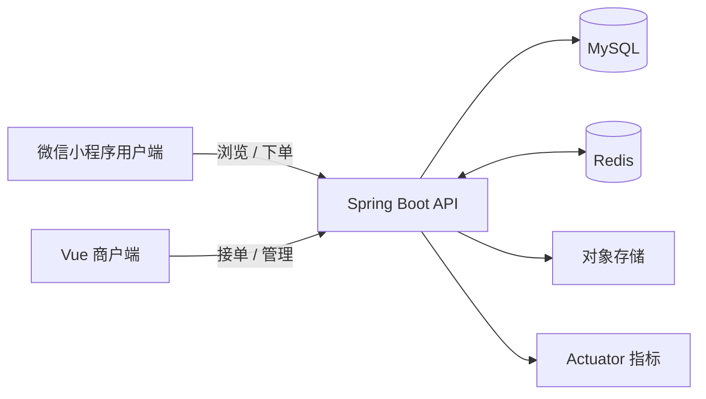
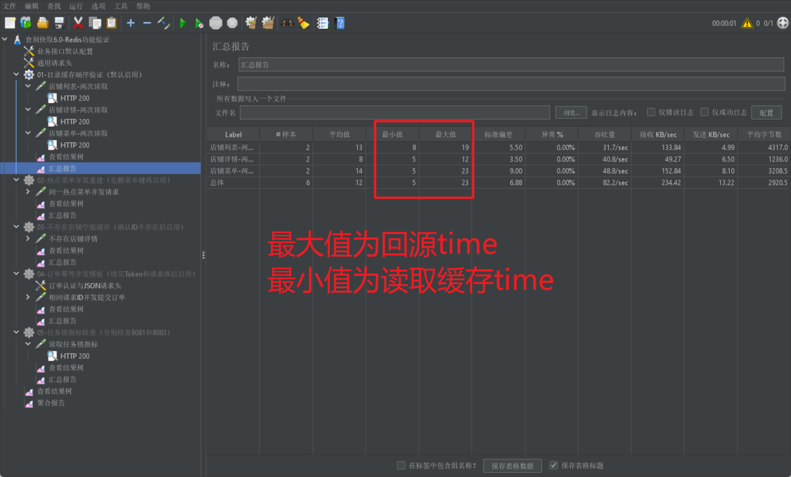

<div align="center">
  
  <h1>食刻快取 · QuickPick</h1>
  <p>面向校园食堂的微信小程序点餐与商户运营平台</p>

  <p>
    <a href="https://github.com/Fuzee2046/QuickPick-OpenSourceVersion/releases/tag/v6.0.0-public"></a>
    
    
    
    
    
  </p>

  <p>
    <strong>个人创业项目</strong> · <strong>校园真实运行</strong> · <strong>持续迭代</strong>
  </p>
</div>

---

## 项目简介

食刻快取是一个已经在校园食堂场景中运行的真实项目，目标是把“排队点餐、商户接单、订单履约、经营统计”串成一条可持续运营的业务链路。

项目由三个端组成：

- **用户端**：微信小程序浏览店铺、查看菜品、提交订单、查询取餐状态。
- **商户端**：商户登录、菜品管理、订单处理、经营数据和账单管理。
- **服务端**：Spring Boot REST API、权限认证、订单领域逻辑、Redis 基础设施和定时任务。

## 业务闭环



## 核心技术亮点

| 方向 | 实现内容 | 解决的问题 |
| --- | --- | --- |
| **Redis 缓存** | 店铺、菜品目录和首页列表缓存，TTL 与主动失效 | 降低高频读请求的数据库压力 |
| **热点 Key 防护** | 互斥锁重建热点缓存 | 避免缓存同时失效时大量请求回源 |
| **缓存穿透防护** | 对不存在店铺写入短 TTL 空值 | 避免恶意或重复无效查询打穿 MySQL |
| **订单幂等** | Redis Lua 原子状态机 + 数据库唯一约束兜底 | 同一请求重复提交只创建一笔订单 |
| **分布式任务锁** | `SET NX EX` 竞争任务锁，实例无锁则跳过本轮 | 多实例部署时避免定时任务重复执行 |
| **故障降级** | Redis 能力开关、健康检查和缓存旁路 | Redis 不可用时核心业务仍可回源运行 |
| **可观测性** | Spring Boot Actuator health / metrics | 快速确认实例、Redis 和关键指标状态 |

## Redis 真实测试证据

项目将 JMeter、Redis 客户端和后端多实例测试结果整理进商户端作品集页面，覆盖五类典型企业场景：

1. 目录缓存命中与回源对比
2. 热点 Key 互斥重建
3. 缓存穿透与空值 TTL
4. 订单提交幂等防重
5. 定时任务分布式锁



更多测试截图和说明位于商户端作品集资源目录：
`quickpick-merchant-pwa/src/assets/portfolio/redis/`

## 仓库结构

```text
quickpick-backend/quickpick/       Spring Boot 后端、Redis 能力与自动化测试
quickpick-merchant-pwa/            Vue 3 + TypeScript 商户管理端
quickpick-miniprogram/             uni-app 微信小程序用户端
```

## 本地运行

### 环境要求

- JDK 17
- Maven 3.9+
- Node.js 20+
- MySQL 8+
- Redis 7+

### 1. 准备后端配置

复制示例配置并填写自己的本地值：

```bash
cd quickpick-backend/quickpick
cp src/main/resources/application-example.yaml src/main/resources/application.yaml
```

示例配置只包含占位符。数据库密码、JWT 密钥、微信 AppSecret、对象存储密钥和支付私钥必须通过本地配置或环境变量注入，不能提交到 Git。

### 2. 启动后端

```bash
cd quickpick-backend/quickpick
mvn spring-boot:run
```

默认业务端口为 `8080`，Actuator 管理端口为 `8081`。本地 Redis 默认连接 `127.0.0.1:6379`。

### 3. 启动商户端

```bash
cd quickpick-merchant-pwa
cp .env.example .env.development
npm install
npm run dev
```

### 4. 启动小程序端

在 `quickpick-miniprogram/` 安装依赖后，使用 HBuilderX 或 uni-app CLI 运行微信小程序；接口地址通过 `.env.development` 中的 `VITE_API_BASE_URL` 配置。

## 安全边界

这是一个脱敏开源版本：

- 不包含生产数据库、真实账号、Token、服务器地址和部署文档。
- SQL 初始化脚本未公开，仅保留数据安全说明。
- COS、微信登录和支付能力默认使用占位配置或关闭。
- 作品集截图已做公开展示处理，仅用于说明测试过程和结果。

## 项目说明

本仓库用于展示项目架构、工程实践和可复现的代码组织方式。生产环境的部署配置、数据迁移和密钥管理不属于公开仓库的一部分。

## License

[MIT License](LICENSE)

<div align="center">
  <sub>QuickPick · 食刻快取 · 让校园点餐更简单</sub>
</div>
