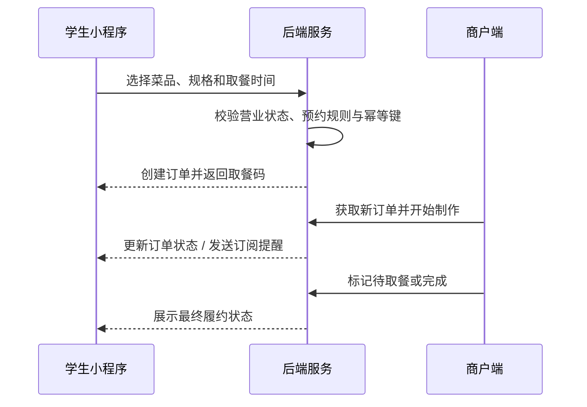
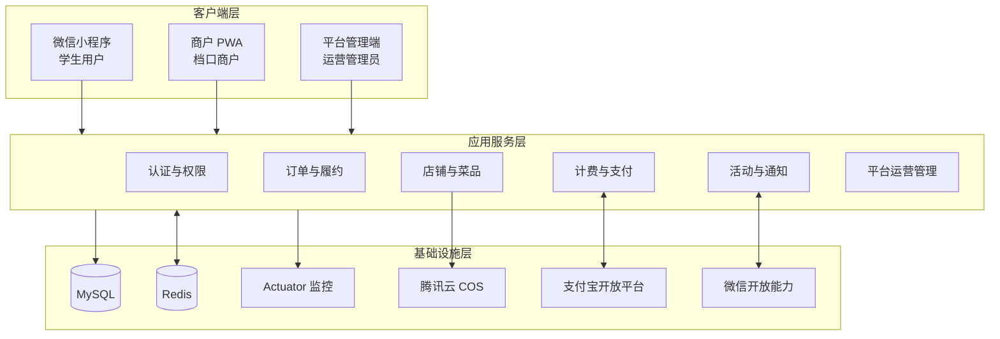
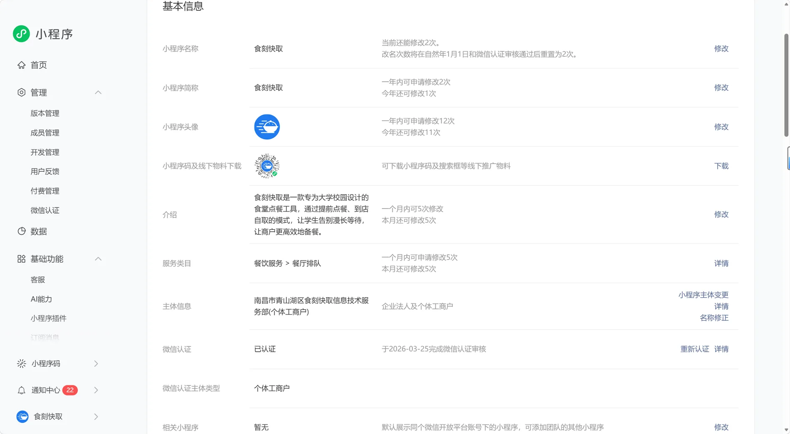
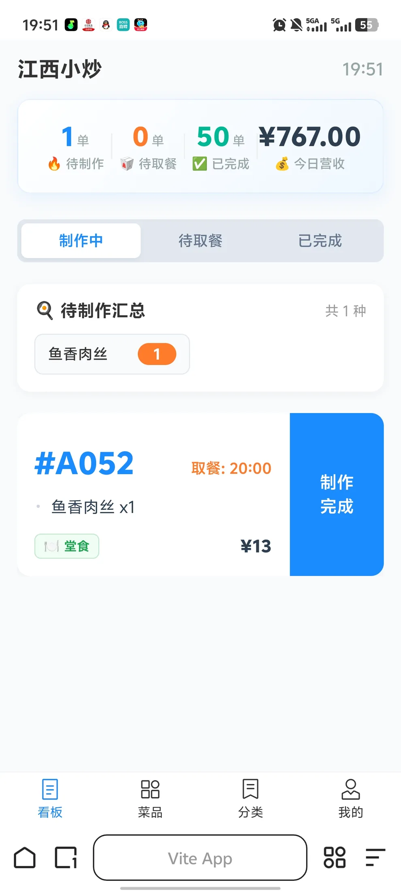
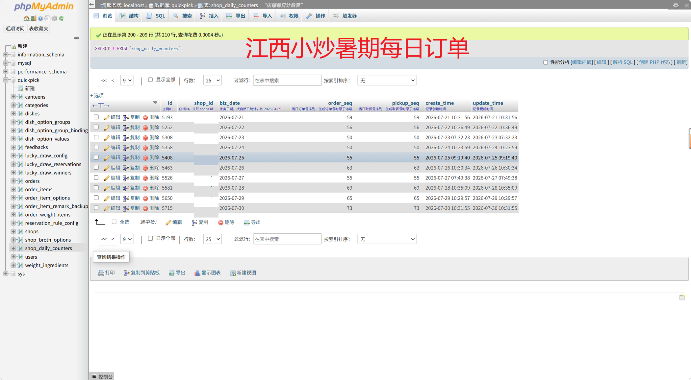

<div align="center">
  
  <h1>食刻快取 · QuickPick</h1>
  <p><strong>面向校园食堂的微信小程序点餐、商户经营与平台管理系统</strong></p>

  <p>
    <a href="https://github.com/Fuzee2046/QuickPick-OpenSourceVersion/tree/v6.0.0-public"></a>
    
    
    
    
    
  </p>

  <p>
    <strong>个人创业项目</strong> · <strong>已完成工商登记</strong> · <strong>小程序已认证</strong> · <strong>校园真实运行</strong> · <strong>稳定盈利</strong>
  </p>

  <p>
    <a href="#项目概览">项目概览</a> ·
    <a href="#功能全景">功能全景</a> ·
    <a href="#核心业务流程">业务流程</a> ·
    <a href="#系统架构">系统架构</a> ·
    <a href="#工程设计">工程设计</a> ·
    <a href="#本地运行">本地运行</a>
  </p>
</div>

---

## 项目概览

食刻快取起源于校园午餐高峰期的真实排队问题：学生需要在有限的课间时间内完成点餐、等待和取餐，商户又缺少低成本的线上接单与经营工具。项目通过微信小程序提前收集订单，让商户提前制作、学生按预约时间取餐，同时提供菜品管理、称重确认、订单履约、经营统计、平台计费和运营活动能力。

这不是单一的课程 Demo，而是一个从需求调研、产品设计、全栈开发、商户接入到日常运营持续迭代的完整项目。目前仓库覆盖：

- 面向学生的 **微信小程序用户端**；
- 面向食堂档口的 **商户 PWA 管理端**；
- 面向平台运营人员的 **管理员后台**；
- 承载认证、订单、计费、支付、缓存和定时任务的 **Spring Boot 服务端**。

## 产品组成

| 系统 | 面向角色 | 主要职责 | 前端技术 |
| --- | --- | --- | --- |
| **用户端小程序** | 校园学生 | 浏览店铺、选择餐品、预约取餐、查看订单、参与活动 | uni-app、Vue、Pinia |
| **商户管理端** | 食堂档口商户 | 接单履约、菜品配置、称重确认、经营统计、账单支付 | Vue 3、TypeScript、Vant、PWA |
| **平台管理端** | 平台管理员 | 店铺与用户管理、订单治理、计费配置、活动配置、审计导出 | Vue 3、Element Plus、ECharts |
| **后端服务** | 三端共同使用 | 权限、业务规则、数据存储、支付回调、缓存、调度与监控 | Spring Boot、MyBatis-Plus、MySQL、Redis |

## 功能全景

### 用户端小程序

- **微信登录与身份认证**：支持微信小程序登录，服务端签发 JWT，保持用户会话。
- **食堂与店铺浏览**：按食堂查看可营业店铺，展示营业状态、封面、档口地址和经营信息。
- **固定菜品点餐**：支持分类菜单、菜品规格选项、数量调整、购物车和订单备注。
- **自选称重点餐**：支持称重菜品选择、锅底配置、最低起订重量和商户二次确认价格。
- **预约取餐规则**：根据营业时间、高峰规则和店铺限制生成可用取餐时段。
- **订单全流程**：下单、订单列表、订单详情、取餐码、状态跟踪和历史记录。
- **履约风险提示**：查询逃单/未取餐风险状态，引导用户处理异常订单。
- **免单活动**：查看活动、预约参与、定时开奖和结果展示。
- **微信订阅消息**：在订单关键节点向用户发送制作或取餐提醒。
- **用户反馈与协议**：提交意见反馈，并提供隐私政策和服务协议页面。

### 商户管理端

- **商户认证**：商户账号登录、JWT 鉴权、首次登录改密和个人资料查看。
- **实时订单看板**：查看当日订单，按制作中、待取餐、已完成、已取消分类处理。
- **订单状态流转**：接单制作、确认金额、完成取餐、取消订单，并查看完整订单明细。
- **新订单声音提醒**：通过 Web Audio API 播放订单提示音，支持用户主动开启和浏览器兼容处理。
- **遗留订单治理**：自动检查跨日未完成订单，商户可标记完成、未取餐或取消。
- **固定菜品管理**：新增、编辑、上下架和删除菜品，支持拖拽排序、分类和规格绑定。
- **自选称重管理**：配置称重菜品、锅底、最低重量和经营模式。
- **称重订单确认**：调用设备相机或相册上传电子秤凭证，确认最终重量和订单金额。
- **店铺经营配置**：营业状态、营业时间、高峰限流和称重模式配置。
- **经营数据统计**：查看当日订单量、完成情况和营业额等经营指标。
- **月度账单中心**：查看免费额度、计费订单、预估费用、账单状态、减免和支付期限。
- **支付宝 WAP 支付**：商户可在线支付平台运营成本费，并自动确认支付结果。
- **PWA 能力**：支持移动端浏览器安装和接近原生应用的使用体验。

### 平台管理端

- **运营驾驶舱**：按今日、近 7 日、近 30 日、本月或自定义区间查看订单与经营趋势。
- **多维数据分析**：每日商户订单堆叠图、成交趋势、商户排行和状态分布。
- **订单管理**：分页筛选全平台订单、查看订单详情，并对异常状态进行人工纠正。
- **商户管理**：新增和编辑店铺、设置展示状态、管理食堂、重置商户临时密码。
- **用户管理**：查看用户订单与履约情况，处理逃单次数和账号处罚状态。
- **反馈管理**：处理用户反馈、维护处理状态、管理员回复与内部备注。
- **预约规则配置**：统一维护高峰预约、时间间隔和取餐规则。
- **活动配置**：维护免单活动时间、奖品、中奖人数和活动状态。
- **计费方案管理**：配置生效月份、免费订单数、超额单价、宽限期和支付宝开关。
- **账单运营**：生成月度账单、调整或减免金额、同步支付状态、查看平台收入汇总。
- **操作审计**：记录管理员、操作类型、目标对象和原因，降低高权限操作风险。
- **数据导出**：支持订单、商户、用户和反馈等运营数据导出。

## 核心业务流程

### 固定菜品订单



### 自选称重订单

自选称重模式下，用户先提交选品和预计取餐时间；商户备餐后通过相机拍摄电子秤凭证，录入实际重量并确认最终价格；用户端同步展示确认后的金额和订单状态。这一流程兼顾了麻辣烫、自选菜等“先选品、后称重”的校园档口场景。

### 商户计费与支付宝支付

平台运营成本费与学生餐费相互独立。系统按商户每月已完成订单生成账单，扣除免费额度后按超出订单数计费：

```text
计费订单数 = max(已完成订单数 - 免费订单额度, 0)
应付金额   = 计费订单数 × 单价 + 管理员调整金额
```

支付闭环包含：账单生成、每日提醒、支付宝 WAP 下单、RSA2 异步通知验签、应用与收款账号校验、支付金额校验、主动查单同步、账单结清以及逾期限制接单。管理员还可以对账单进行减免、作废或金额调整，并保留操作记录。

## 系统架构



## 技术栈

| 层次 | 技术 |
| --- | --- |
| **后端框架** | Java 17、Spring Boot 3.1、Spring MVC、Spring Security |
| **数据访问** | MyBatis-Plus、JdbcTemplate、MySQL 8 |
| **缓存与分布式** | Redis、Spring Data Redis、Lua、Redisson |
| **认证安全** | JWT、BCrypt、角色路由隔离、管理员操作审计 |
| **支付与外部服务** | 支付宝 Java SDK、RSA2、微信小程序 API、腾讯云 COS SDK |
| **商户/管理前端** | Vue 3、TypeScript、Vite、Pinia、Vant、Element Plus、ECharts |
| **小程序端** | uni-app、Vue、Pinia、微信小程序能力 |
| **工程与监控** | Maven、PWA、Spring Boot Actuator、JMeter |

## 工程设计

### 1. 订单状态与事务边界

订单创建、状态更新、称重确认、取消和异常订单处理均在后端校验当前状态及所属商户。关键写操作通过事务保证订单主表、订单项、规格项和称重项的一致性，数据库唯一索引作为并发场景的最终兜底。

### 2. 多角色认证与权限隔离

学生、商户和管理员使用独立认证入口。Spring Security 与 JWT 过滤器解析身份，商户接口校验店铺归属，管理员接口限制管理角色；首次登录改密和 BCrypt 密码哈希降低账号初始化风险。

### 3. 支付安全

支付宝支付不仅接收前端返回结果，而是以服务端异步通知和主动查单为准。后端会验证 RSA2 签名、AppID、SellerID、交易状态、商户账单归属和实际支付金额，并以事务方式更新支付流水与账单状态。

### 4. 文件与凭证管理

菜品图片、店铺图片、锅底图片及称重价格凭证统一通过后端上传到对象存储。上传接口按照管理员和商户角色隔离，避免客户端直接持有云服务密钥。

### 5. 运营与审计

平台管理端将经营看板、异常订单治理、商户账号维护、用户处罚、计费调整和活动配置集中管理。敏感操作记录操作者、目标对象和原因，便于后续追踪。

### 6. Redis 工程化能力

Redis 是系统基础设施的一部分，而非业务成立的前提。项目在不改变核心业务正确性的基础上加入以下能力：

| 能力 | 实现 | 价值 |
| --- | --- | --- |
| 店铺与菜品缓存 | 首页列表、店铺详情、固定菜单和称重菜单缓存 | 减少稳定目录数据的重复查询 |
| 热点 Key 重建 | Redis 互斥锁控制单实例回源 | 防止缓存失效瞬间并发打向数据库 |
| 缓存穿透防护 | 不存在数据写入短 TTL 空值 | 拦截重复无效查询 |
| 订单幂等 | Lua 原子状态机管理处理中、成功和失败状态 | 相同请求 ID 并发提交只创建一笔订单 |
| 分布式定时任务 | Redisson 锁与所有权校验 | 多实例下避免开奖、提醒等任务重复执行 |
| 故障降级 | Redis 功能开关、异常旁路与数据库回源 | Redis 不可用时保留核心点餐能力 |
| 可观测性 | Actuator health / metrics | 检查 Redis 健康、缓存命中和回源情况 |

### 7. 定时任务

系统通过定时任务完成免单活动开奖、订单取餐提醒和月度计费相关处理。多实例部署时由分布式锁决定本轮执行实例，没有拿到锁的实例直接跳过，避免重复通知和重复业务处理。

## 真实运行与测试

下列图片来自项目实际运营或脱敏后的测试记录，而非 UI 模拟数据。

<table>
  <tr>
    <td align="center" width="33%"><br/><sub>微信小程序认证</sub></td>
    <td align="center" width="33%"><br/><sub>商户接入后的真实经营记录</sub></td>
    <td align="center" width="33%"><br/><sub>脱敏后的每日订单统计</sub></td>
  </tr>
</table>

Redis 专项测试覆盖目录缓存、热点 Key 重建、缓存穿透、订单幂等和多实例分布式锁：


完整作品集数据位于：

```text
quickpick-merchant-pwa/src/assets/portfolio/
```

## 仓库结构

```text
QuickPick-OpenSourceVersion/
├── quickpick-backend/quickpick/
│   ├── src/main/java/com/fujian/
│   │   ├── config/              # 安全、Redis、Web 配置
│   │   ├── controller/          # 用户、商户、管理员接口
│   │   ├── service/             # 订单、计费、支付、缓存和调度
│   │   ├── mapper/              # MyBatis-Plus Mapper
│   │   └── pojo/                # 领域实体
│   └── src/test/                # Redis 与业务测试
├── quickpick-merchant-pwa/
│   └── src/views/
│       ├── admin/               # 平台管理端
│       └── *.vue                # 商户端与作品集
├── quickpick-miniprogram/
│   └── src/pages/               # 用户端小程序页面
└── SQL/README.md                # 数据库脚本公开边界说明
```

## 本地运行

### 环境要求

- JDK 17
- Maven 3.9+
- Node.js 20+
- MySQL 8+
- Redis 7+
- 微信开发者工具或 HBuilderX（运行小程序时需要）

### 1. 准备后端配置

复制示例配置并填写自己的本地值：

```bash
cd quickpick-backend/quickpick
cp src/main/resources/application-example.yaml src/main/resources/application.yaml
```

至少需要配置 MySQL。Redis 默认使用 `127.0.0.1:6379`；微信、COS 和支付宝使用占位配置或保持关闭即可完成基础代码阅读与编译。

### 2. 启动后端

```bash
cd quickpick-backend/quickpick
mvn spring-boot:run
```

默认业务端口为 `8080`，Actuator 管理端口为 `8081`。

### 3. 启动商户端与管理端

商户端和平台管理端位于同一个 Vue 工程，通过登录角色和路由区分：

```bash
cd quickpick-merchant-pwa
cp .env.example .env.development
npm install
npm run dev
```

### 4. 启动小程序端

```bash
cd quickpick-miniprogram
cp .env.example .env.development
npm install
npm run dev:mp-weixin
```

然后使用微信开发者工具导入生成的小程序构建目录。接口地址由 `VITE_API_BASE_URL` 控制。

### 5. 编译检查

```bash
cd quickpick-backend/quickpick
mvn -DskipTests compile
```

Redis 集成测试需要先启动本地 Redis；业务完整运行还需要根据实体和 Mapper 准备自己的测试数据库。

## 开源与安全说明

本仓库是从正式版本导出的独立脱敏快照，使用全新的 Git 历史：

- 不包含生产配置、真实密钥、Token、数据库账号、服务器地址和部署文档。
- 数据库建表、迁移和生产数据未公开，仅保留数据安全说明。
- `application-example.yaml` 和 `.env.example` 只包含本地占位值。
- 支付、微信登录和对象存储默认关闭或使用占位配置。
- 作品集图片经过公开展示处理，用于说明项目真实性和测试过程。

生产环境的密钥管理、部署脚本、数据库迁移和商户数据不属于公开仓库的一部分。

## License

[MIT License](LICENSE)

<div align="center">
  <sub>QuickPick · 食刻快取 · 让校园点餐更简单</sub>
</div>
